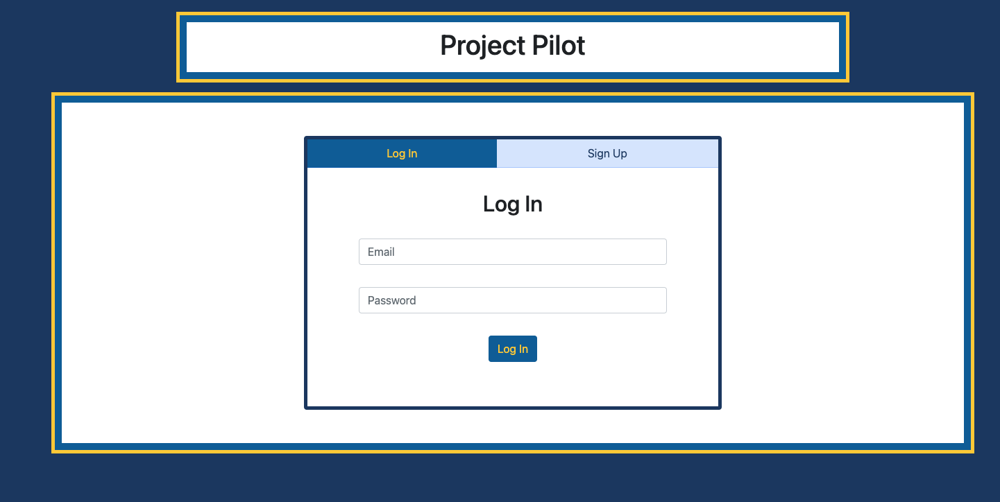
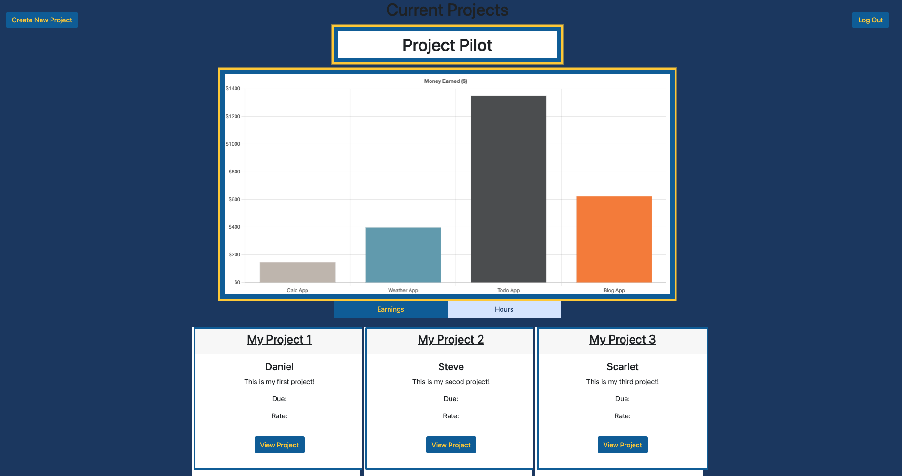

# Project Pilot
#### Aubrey Johnston, Daniel Hernandez, Scarlet Bowen, Danny Ngyuen, Travis Miller
 

## Technologies Used
<ul>
    <li>Node.js</li>
    <li>Express</li>
    <li>MySQL</li>
    <li>Sequelize</li>
    <li>Dotenv</li>
    <li>Bcrypt</li>
    <li>Handlebars</li>
</ul>    

 

## Description

This application is designed for freelancers to have a place to store and track their personal projects that they have made. Users will be able to log into their personal account, see all the posts they've made, and create new project logs as well. Each project log will contain information such as the project name, description, hours spent, money earned, and more! This solves the problem of wondering where to keep an organized system of all finished projects and gives users a polished and clean UI to work with as well. What makes this application stand out is the ability for it to track the hours spent on a project and display that data in a chart for simple readability.

 

 

## Installation
No installation is required, simply visit the deployed website link:
 

<link>

 

## Usage
Upon loading the site, users will be prompted to either log in or create a new account. After logging in, a dashboard with all listed projects will be displayed and users will have the option to click on a project for more information, add a new project via the create project button, and log out with the logout button if they wish.  

   

 